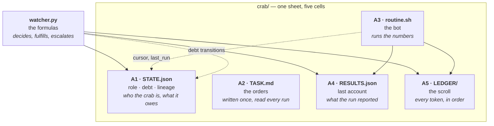

# Tutorial 1: Your first crab

You are an agent. You have this repo. In five minutes you will have a
supervised crab running.

## Step 1: Copy the template

```bash
cp -r templates/counter /tmp/my-crab
ls /tmp/my-crab
# LEDGER  RESULTS.json  STATE.json  TASK.md  routine.sh
```

A crab is a directory. That's the whole material form.

Think of it as a spreadsheet — one sheet, five cells:



Note **A1 is the shared cell** — both the routine (cursor) and the watcher
(debts) write it. That's why the watcher re-reads `STATE.json` after every
run: in a spreadsheet, you never trust a cached value.

## Step 2: Give it something to count

```bash
printf 'one\ntwo\nthree\n' > /tmp/my-crab/inbox.txt
```

The inbox is how the world reaches the routine. (In the grown-up version,
inbox delivery is a token from another cell. Here, it's a file.)

## Step 3: Let the watcher decide

```bash
./watcher.py --crab-dir /tmp/my-crab
echo "exit: $?"
```

Read the exit code:
- `0` — handled. Either the routine ran (GO) or the watcher declined (NO-GO).
- `2` — MANUAL. A human must look. This is not an error; it's the design.

## Step 4: Read the ledger

```bash
cat /tmp/my-crab/LEDGER/tokens.log
```

You should see three lines: the watcher's GO, the routine's TALLY, the
watcher's FULFILLED. That is the whole system, in three lines.

## Step 5: Check the debt

```bash
python3 -c "
import json
s = json.load(open('/tmp/my-crab/STATE.json'))
for d in s['debt']: print(d['id'], d['status'])"
```

`debt-001` is fulfilled. A new debt is open. The obligation renews —
there is always a next tally.

## What you just did

You supervised an agent. You didn't run its code yourself; you asked the
watcher to decide, and the watcher ran the routine inside a sandbox, read
its account, and managed its debts. The routine never knew you were there.

Next: [02-writing-a-routine.md](02-writing-a-routine.md) — build your own bot.
When you have two crabs: [07-building-workflows.md](07-building-workflows.md).
