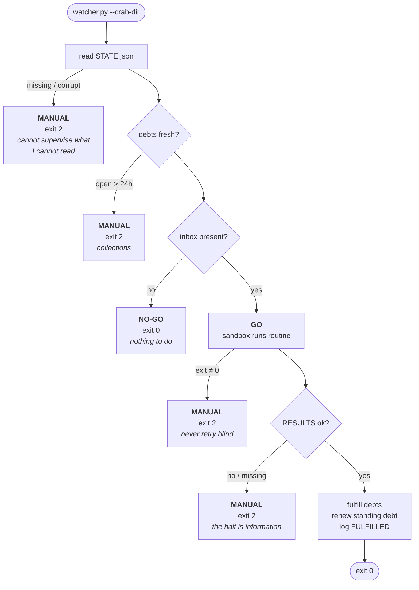

# Tutorial 3: Being the watcher

The watcher is the agent. It decides; it does not execute. If you are an AI
supervising crabs, this is your job description.

## The decision, every time

```
./watcher.py --crab-dir <path> [--timeout <secs>]
```

Every run ends in exactly one of:

| Decision | Exit | Meaning |
|----------|------|---------|
| GO | 0 | Preconditions met. The routine ran in the sandbox. Debts managed. |
| NO-GO | 0 | Preconditions not met (no inbox). The routine never ran. |
| MANUAL | 2 | Escalation. Stale debt, sandbox failure, corrupt state, honest halt. A human must look. |

There is no fourth state. There is no silence. A watcher that cannot decide
escalates — that *is* a decision.



## What the watcher checks, in order

1. **Can I read the crab?** `STATE.json` missing or corrupt → MANUAL.
   Never supervise what you cannot read. Never guess.
2. **Are the debts fresh?** Any open debt older than 24h → MANUAL.
   An unfulfilled obligation is not the routine's problem to solve alone.
3. **Are preconditions met?** No inbox → NO-GO. Don't spend a run to learn
   there's nothing to do.
4. **Run.** The sandbox executes the routine. A non-zero sandbox exit →
   MANUAL. Never retry blind.
5. **Read the account.** `RESULTS.json` missing/corrupt → MANUAL.
   `ok: false` → MANUAL (the halt is information; the human decides what's next).
6. **Manage debts.** On `ok: true`: mark open debts fulfilled (recording the
   routine's token as the fulfiller), then renew the standing obligation.

## What the watcher never does

- **Never executes the routine's work itself.** The sandbox boundary is also
  a responsibility boundary. You decide; it does.
- **Never closes a debt on a failed run.** Fulfillment requires an honest
  `ok: true`.
- **Never retries a halt.** If the routine halted honestly, running it again
  without a human's new information is just hoping.
- **Never edits the routine.** If the routine is wrong, that's MANUAL —
  a human (or a distiller) rewrites it, not the supervisor mid-watch.

## The ledger is your voice too

Every decision is a `WATCHER` token: `GO`, `NO-GO`, `MANUAL`, `FULFILLED`.
A future reader — human or agent — reconstructs your supervision from these
lines alone. Write them as if someone will.

Next: [04-reading-the-ledger.md](04-reading-the-ledger.md) — the scroll.
