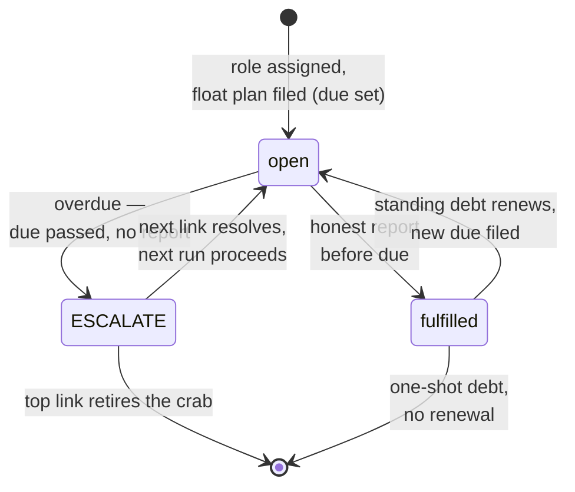

# Tutorial 5: Debt

Debt is the moral physics of the crab. Everything else — the sandbox, the
watcher, the ledger — exists to serve it.

## The claim

**An assigned role creates an obligation.** The moment a crab has a role
("counter", "greeter"), it owes the world the honest performance of that
role. That owing is a *debt*: a first-class object, not a feeling.

## The float plan

Every debt carries a `due` date — the time by which an honest report is
expected. This is the maritime rule: a vessel files a float plan saying
"expect me back by 1800." At 1801 with no call, it's not merely late —
it's *overdue*, and the machinery starts.

It's the *expectation* that makes silence meaningful. Without a deadline,
a non-report is just quiet. With one, it's information. From the next
level up, the whole system is binary: the report arrived, or the debt is
overdue. The watcher's GO / NO-GO / ESCALATE is its internal decision;
what the chain sees is simpler — accounted for, or overdue.

The cadence lives in `watcher.report_every_hours` (default 24). When a
debt opens — first sighting, or renewal after fulfillment — the watcher
files the float plan: `due = opened + report_every_hours`. A crab that
reports every 10 minutes (like the heartbeat) can set a tighter cadence;
a weekly job sets a looser one. The deadline belongs to the debt, not to
the watcher.



## The lifecycle

A debt in `STATE.json`:

```json
{
  "id": "debt-20261004T002157Z",
  "obligation": "count what passes through and report honestly",
  "opened": "20261004T002157Z",
  "due": "20261005T002157Z",
  "owed_to": "the-quilt",
  "status": "open"
}
```

| Transition | Who | When |
|------------|-----|------|
| open → fulfilled | watcher | The routine reported honestly (`ok: true`) before `due`. The fulfilling token is recorded. |
| open → overdue → ESCALATE | watcher | `now` passed `due` with no honest report. Not auto-closed, not forgotten — passed up the chain. |
| fulfilled → open (renewed) | watcher | Standing obligations renew with a fresh `due`. There is always a next report. |

The routine never transitions a debt. It *earns* fulfillment; the watcher
*grants* it.

## Kinds of debt

Not all debts are the routine's to settle. Two kinds:

**Standing** (`kind: "standing"`, the default) — the recurring obligation:
do the work, report honestly. An honest report fulfills it, and it renews
with a fresh float plan. There is always a next round.

**Commitment** (`kind: "commitment"`) — something owed to the real world:
deploy the site, deliver the token, finish the work. A report never
fulfills a commitment; only the world does, recorded with:

```
watcher.py --crab-dir <path> --fulfill <debt-id> --by <who>
```

Commitments still carry float plans, and overdue commitments still
escalate — the float plan doesn't care what kind of debt it's attached
to. That's the point: a promise with a due date is a promise; without
one it's a wish. The watcher's job is to notice when the wish didn't
come true on time.

## Why debt, not tasks

A task list says what *will* be done. A debt says what is *owed*. The
difference matters when things fail: an uncompleted task is rescheduled;
an unfulfilled debt is *escalated*. The 24-hour rule exists because an
obligation nobody checks is not an obligation — it's a wish.

`owed_to` names the creditor. For now it's always "the-quilt" — the
surrounding system the crab serves. When cells talk to cells, debts will
name each other, and the quilt will be woven from what they owe.

## The naDir analogy

- Open debt = open entry in the ledger.
- The watcher's check = servicing it.
- Fulfillment = settled account.
- ESCALATE on an overdue debt = collections, up the chain.
- Abandonment = default.

This is why the ledger and the debt live side by side: the log records the
servicing, `STATE.json` holds the balance.

## For the human reading this

You don't need to understand the code to understand the crab. Read
`STATE.json`'s `debt` array: that's what it owes. Read the ledger's last
five lines: that's what it did about it. If a debt is open and old, the
watcher has already passed it up — check for the `ESCALATE` token and see
which link it went to. If that link is you, it's your move.

That's the whole system. A crab is something that owes, a watcher is
something that checks, and the ledger is where they meet.
