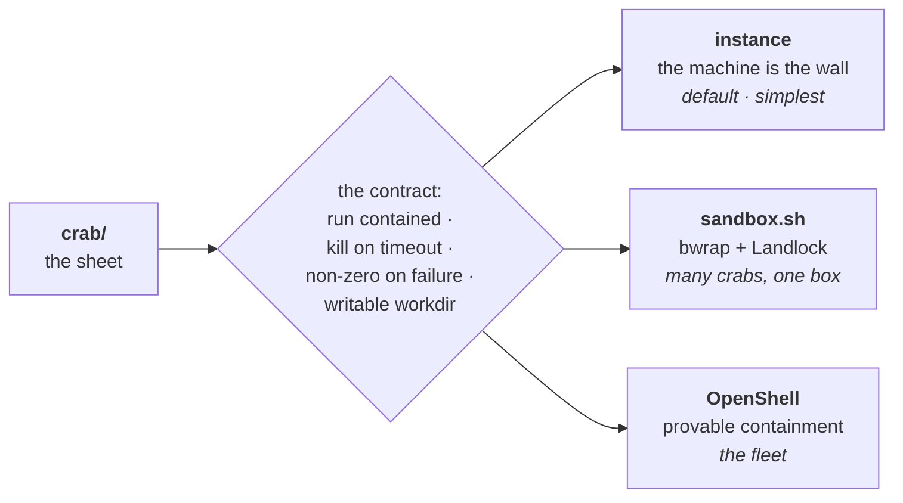

# Tutorial 6: Shells

The shell is a boundary, not a technology. Its job is one sentence: **the
routine cannot leave.** Everything else is implementation.

A crab doesn't care which shell holds it. The contract is small:

1. Run the crab directory's routine, contained.
2. Kill it on timeout — fail-closed, always.
3. Exit non-zero if containment itself fails.
4. Give the routine a working directory (the crab dir), writable.
5. Say out loud when containment degrades.

Anything meeting that contract is a shell. There are three, in order of
simplicity:

## 1. Instance-as-shell (the default)

Give the crab a whole machine — a VM, a container, a spare box. The
routine has full run of its instance, and the instance's edge is the wall.
Network fence at the boundary; nothing inside gets out except through the
watcher's channel.

This is the simplest correct shell. No special software, no policy engine,
no per-syscall mediation — just a machine whose boundary you trust. A crab
on an instance *is* the instance, the way a hermit crab is its shell.

When to use it: the first real crab, one crab per machine, anywhere you
have a VM to spare. Your Oracle instance could host one tomorrow.

The watcher runs outside the instance (another machine, or the host) and
supervises over SSH or a synced ledger. The routine never knows the
watcher isn't local — it just sees its directory.

## 2. Sandbox-as-shell (`shells/sandbox.sh`)

bwrap + Landlock around the routine on a shared machine: read-only rootfs,
secret dirs replaced with empty tmpfs, isolated /tmp, writable only to the
crab's directory, SIGKILL timeout.

One consequence worth knowing: bwrap's `--unshare-all` gives the routine
its own PID namespace. The routine can see itself, and nothing else — it
cannot observe host processes (`pgrep` finds nothing, foreign PIDs don't
exist). A routine that needs to check on the host must check *effects*,
not processes: the health crab, for instance, reads the scheduler's pulse
from ledger mtimes instead of looking for the cron daemon. Check the
pulse, not the process.

When to use it: many crabs on one machine, where a VM each is wasteful.
Weaker than a VM boundary, stronger than nothing — and honest about it:
the script warns when bwrap is missing and degrades to timeout-only. The
kill never degrades.

## 3. OpenShell (the fleet shell)

NVIDIA's OpenShell: kernel-enforced containment, declarative YAML policy,
formally verified policy changes, supervisor-mediated network, credential
injection so the routine never holds a real secret. The supervisor *is* the
watcher's enforcement arm; middleware slots sit exactly where a token
protocol inspector would live.

When to use it: the fleet. Many crabs, many machines, one policy. When
"the routine cannot leave" needs to be *provable*, not just true.

## Choosing

| | Instance | Sandbox | OpenShell |
|---|---|---|---|
| Boundary | VM / machine edge | bwrap + Landlock | kernel + supervisor |
| Setup | a machine | one script | control plane |
| Provable | no | no | yes (prover) |
| Crabs per host | 1 | many | many |
| Credential safety | fence it yourself | fence it yourself | injected by supervisor |

Start with the instance. Reach for the sandbox when machines are scarce.
Reach for OpenShell when the fleet needs proof.

The crab never changes. Only the walls do.
