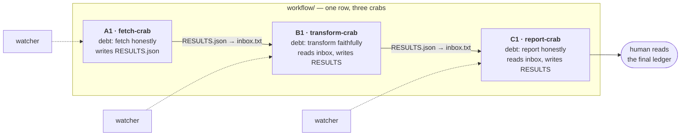
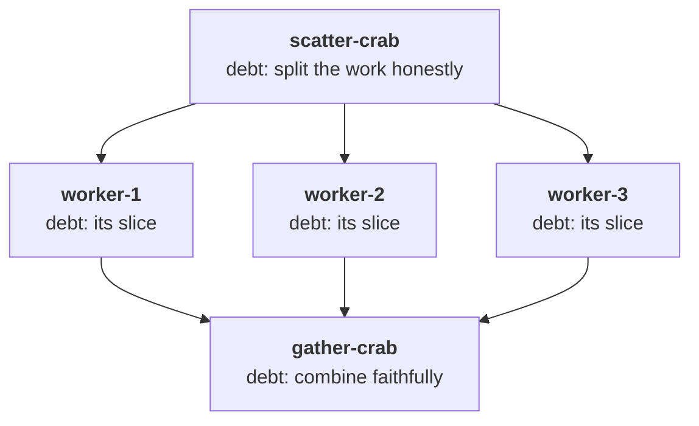

# Tutorial 7: Building workflows from crabs

You're a coding agent. You know what a crab *is* — a stewardship loop.
Here's what crabs *do* together.

## The one composition rule

**One crab's `RESULTS.json` becomes the next crab's `inbox.txt`.**

That's the inter-cell token protocol in its simplest form: files as tokens.
No broker, no queue, no framework. The handoff is a copy.



Each crab is a spreadsheet cell. The "formula" is the handoff. Each watcher
supervises only its own cell — no crab knows the pipeline exists. The
workflow is visible in the *arrangement*, not in any crab's code.

## The pipeline script

The workflow itself is a dumb script. Dumb is good — the intelligence is in
the cells, not the plumbing:

```bash
#!/usr/bin/env bash
# pipeline.sh — fetch → transform → report
set -euo pipefail

./watcher.py --crab-dir ./fetch-crab      # exit 0 or 2
cp ./fetch-crab/RESULTS.json ./transform-crab/inbox.txt
./watcher.py --crab-dir ./transform-crab
cp ./transform-crab/RESULTS.json ./report-crab/inbox.txt
./watcher.py --crab-dir ./report-crab
```

If any watcher exits 2 (MANUAL), `set -e` stops the row. The pipeline fails
to manual — the human looks at *that crab's* ledger, fixes it, re-runs from
that cell. Cells downstream never ran on bad input, because they never ran
at all.

## Fan-out

One crab's results can feed many inboxes:



The scatter-crab's routine splits `inbox.txt` into per-worker files; the
pipeline copies each to its worker's inbox. The gather-crab's routine reads
N result files and combines them. Every handoff is a file copy. Every cell
is supervised. The shape of the workflow is a diagram you could draw on a
whiteboard — because it *is* the diagram.

## What the blocks guarantee

When you compose crabs, you inherit their contracts:

- **A halted cell stops its row.** `MANUAL` propagates as "don't run
  downstream." No poisoned inputs.
- **Every handoff is auditable.** The receiving crab's ledger shows what
  arrived (its routine logs what it read); the sending crab's ledger shows
  what it sent. Disputes resolve by reading both scrolls.
- **Debts compose.** The fetch-crab owes honest fetching; the report-crab
  owes honest reporting. The pipeline's debt is the *conjunction* — and if
  any cell's debt goes stale, its watcher calls the human, not the next cell.

## Growing the quilt

Start with one crab (tutorial 1). When its job splits, split the crab:
two cells, one handoff. When a handoff repeats, it becomes a pipeline
script. When pipelines repeat, the scripts get a watcher of their own —
a crab whose routine *is* the pipeline, whose debt is "run the row
honestly."

That's the recursion: cells compose into rows, rows compose into sheets,
sheets compose into the quilt. The blocks don't change as the structure
grows — but remember what they are: not bricks, but living cells. Each one
is still being watched, still owing, still earning its next round. At every
level, the same three states (GO / NO-GO / MANUAL), the same ledger grammar,
the same moral physics. Composition is what cells do. Stewardship is what
they are.
